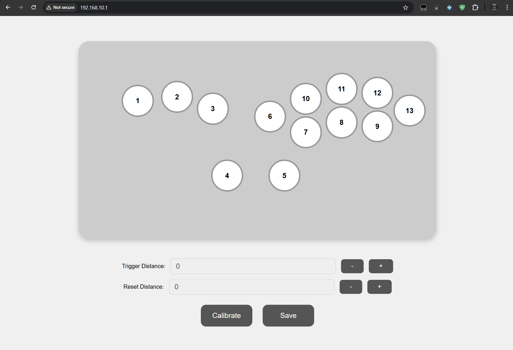
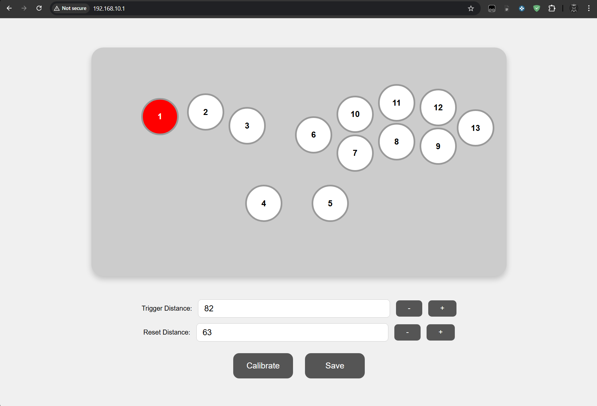
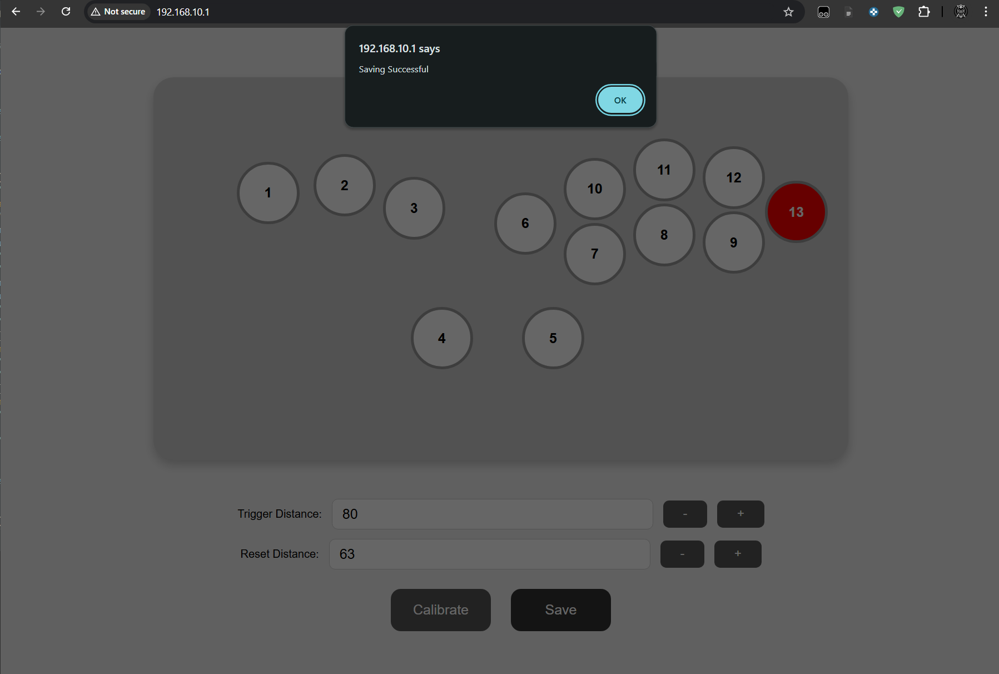

# HE_Leverless

# 🎮 Hall Effect Fighting Game Controller  

A custom-built **fighting game controller** featuring **Hall effect sensors** based on ESP32-S3 for ultra-durable, low latency performance. Designed for competitive play, modularity, and long-term reliability.  

---

## ✨ Features  

- 🕹 **Hall Effect Sensors** – no wear and tear from metal contact based switches 
- 🔧 **Modular Design** – easily replace buttons, just pull out an switch and snap in a new one
- ⚡ **Low Latency** – optimized input response at over 2000Hz polling with fully customizable actuation points for every switch!
- 🌐 **Web UI** - web based UI for customizing board on the go from anywhere without the need for connecting to a PC
- 💻 **Open Source Firmware** – customizable and community-driven  
- 🎨 **Custom Build** – unique layout and aesthetics  

---

## Custom PCB Layout  

| Front View |
|------------|
|  |

Created Using KiCad and custom library and footprints!

### ✅ PCB Features
- Digital and Analog ground plane seperation
- Low count BOM
- One sided for easy of assembly on hot plate or oven!

---

## Web-Based UI 

| Startup View | Selection | Save with Ease |
|------------|------------|------------|
|  |  |  |

Fully integrated and interactable WEB UI from an embedded board

### ✅ WEB-UI Features
- Hosts it's own Wifi you connect to
- Access the configurator from any browser at 192.168.10.1
- Individually switch values can be set with intuitive UI indicating what button you are adjusting

---

## CAD Model  
<!--
| Front View | Inside View | 
|------------|-------------|
|  |  |

*(Replace the image paths with your actual files, e.g., `/assets/controller-front.png`)*  
-->
| Front View |
|------------|
|  |

| WireFrame View |
|------------|
|  |

Designed in Fusion360 with all components modeled for accuracy. 

---

## 🚀 Getting Started  

1. Clone this repo:  
   ```bash
   git clone https://github.com/your-username/your-controller-repo.git
